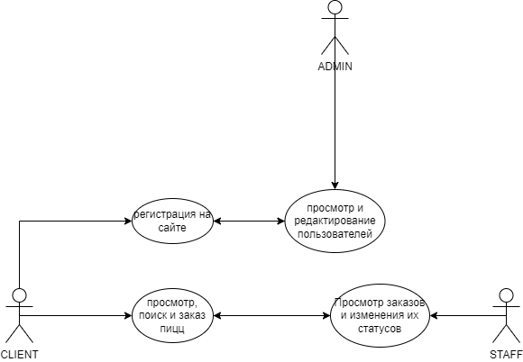
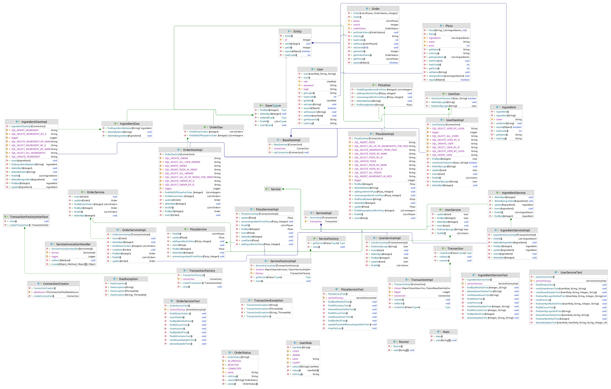
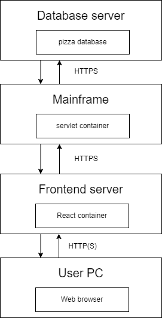

# pizza-site
#Описание

pizza-site - это клиент-серверное приложение для пиццерии, позволяющее пользователям проссматривать каталог,
делать заказ и отслеживать статус своего заказа, а персоналу видеть заказы клиентов, выполнять их и изменять
их статус.
Use-case-diagram

#Технологии

pizza-site - написано с использованием языков Java, React, TypeScript при помощи следующих библиотекех и фреймворков:
1. log4j2 - библиотека для логирования
2. Jacson - библиотека для JSON
3. JUnit5 - библиотека для написания Unit тестов
4. Apache Tomcat9 - контейнер сервлетов

#Структура и Запуск

Диаграмма классов

Диаграмма компонент

Диаграмма развёртования

Для запуска приложения необходимо выполнить следующие шаги:
1. Установить Apache Tomcat 9
2. Добавить необходимые зависимости для Maven в pom.xml
3. При настройке конфигурации указать HTTPport = 8081. Остальное оставить по умолчанию
4. Указать путь до Tomcat на вашем устройстве
5. Запустить проект

